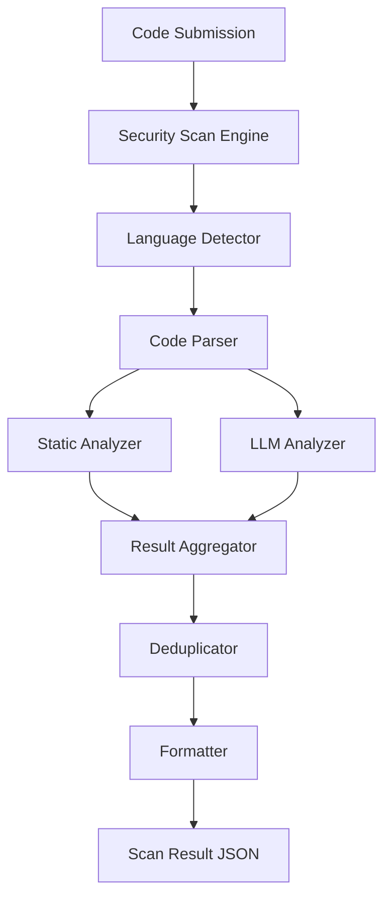

# Design Document

## Overview

The Security Scan Engine is designed as a modular, extensible system that combines rule-based static analysis with LLM-powered contextual analysis. The architecture separates concerns between code parsing, vulnerability detection, result aggregation, and output formatting. This design enables independent evolution of detection strategies while maintaining a consistent interface for consumers.

## Architecture



### Component Flow

1. **Code Submission** enters the Security Scan Engine
2. **Language Detector** identifies the programming language (JS/TS)
3. **Code Parser** creates an abstract representation of the code
4. **Static Analyzer** and **LLM Analyzer** run in parallel
5. **Result Aggregator** collects findings from both analyzers
6. **Deduplicator** removes duplicate issues
7. **Formatter** produces the final JSON output

## Components and Interfaces

### 1. Security Scan Engine (Orchestrator)

**Responsibility:** Coordinates the entire scanning process

**Interface:**
```typescript
interface ISecurityScanEngine {
  scan(code: string, language: string): Promise<ScanResult>;
}
```

**Behavior:**
- Validates input (non-empty code, supported language)
- Orchestrates parallel execution of analyzers
- Handles errors and timeouts
- Returns aggregated results

### 2. Language Detector

**Responsibility:** Identifies the programming language of submitted code

**Interface:**
```typescript
interface ILanguageDetector {
  detect(code: string, fileExtension?: string): Language;
  isSupported(language: Language): boolean;
}

enum Language {
  JAVASCRIPT = 'javascript',
  TYPESCRIPT = 'typescript',
  UNKNOWN = 'unknown'
}
```

**Behavior:**
- Uses file extension hints when available
- Falls back to content-based detection
- Returns UNKNOWN for unsupported languages

### 3. Code Parser

**Responsibility:** Parses code into a structured format for analysis

**Interface:**
```typescript
interface ICodeParser {
  parse(code: string, language: Language): ParsedCode;
}

interface ParsedCode {
  raw: string;
  lines: string[];
  ast?: any; // Abstract Syntax Tree (optional)
  tokens?: Token[];
}

interface Token {
  type: string;
  value: string;
  line: number;
  column: number;
}
```

**Behavior:**
- Splits code into lines for line-based analysis
- Optionally generates AST for deeper analysis
- Handles parsing errors gracefully

### 4. Static Analyzer

**Responsibility:** Detects vulnerabilities using regex patterns and heuristics

**Interface:**
```typescript
interface IStaticAnalyzer {
  analyze(parsedCode: ParsedCode): VulnerabilityIssue[];
}

interface Rule {
  id: string;
  name: string;
  pattern: RegExp;
  severity: SeverityLevel;
  owaspCategory: string;
  description: string;
  fix: string;
}
```

**Behavior:**
- Applies predefined rules to code
- Matches patterns line-by-line
- Records exact position (line, column start/end)
- Returns issues with all required metadata

**Rule Set:**
- SQL Injection: Detects string concatenation in SQL queries
- XSS: Detects innerHTML, dangerouslySetInnerHTML usage
- Hardcoded Credentials: Detects password/apiKey/secret in strings
- Insecure Crypto: Detects MD5, SHA1, weak algorithms

### 5. LLM Analyzer

**Responsibility:** Uses language model for contextual security analysis

**Interface:**
```typescript
interface ILLMAnalyzer {
  analyze(parsedCode: ParsedCode): Promise<VulnerabilityIssue[]>;
  setTimeout(ms: number): void;
}

interface LLMConfig {
  model: string;
  temperature: number;
  maxTokens: number;
  timeout: number;
}
```

**Behavior:**
- Sends code to LLM with security analysis prompt
- Parses LLM response to extract vulnerabilities
- Maps findings to line numbers
- Generates explanations and fixes
- Handles timeouts and API failures

**Prompt Strategy:**
```
Analyze the following code for security vulnerabilities.
For each issue found, provide:
1. Title
2. Description
3. Severity (Critical/High/Medium/Low/Info)
4. OWASP category
5. Line number(s)
6. Recommended fix

Code:
{code}
```

### 6. Result Aggregator

**Responsibility:** Combines results from multiple analyzers

**Interface:**
```typescript
interface IResultAggregator {
  aggregate(results: AnalyzerResult[]): VulnerabilityIssue[];
}

interface AnalyzerResult {
  source: 'static' | 'llm';
  issues: VulnerabilityIssue[];
  errors?: string[];
}
```

**Behavior:**
- Collects issues from all analyzers
- Preserves source information
- Handles partial failures (one analyzer fails)

### 7. Deduplicator

**Responsibility:** Removes duplicate vulnerability findings

**Interface:**
```typescript
interface IDeduplicator {
  deduplicate(issues: VulnerabilityIssue[]): VulnerabilityIssue[];
}
```

**Behavior:**
- Compares issues by line number and issue type
- Keeps the most detailed version (prefers LLM explanations)
- Merges metadata when appropriate

**Deduplication Logic:**
- Two issues are duplicates if:
  - Same line number (±1 line tolerance)
  - Same OWASP category
  - Similar title (fuzzy match)

### 8. Formatter

**Responsibility:** Produces final JSON output

**Interface:**
```typescript
interface IFormatter {
  format(issues: VulnerabilityIssue[], metadata: ScanMetadata): ScanResult;
}
```

**Behavior:**
- Sorts issues by severity then line number
- Adds scan metadata (timestamp, duration, analyzer versions)
- Ensures all required fields are present

## Data Models

### VulnerabilityIssue

```typescript
interface VulnerabilityIssue {
  id: string; // Unique identifier
  title: string;
  description: string;
  severity: SeverityLevel;
  owaspCategory: string;
  line: number;
  columnStart: number;
  columnEnd: number;
  fix: string;
  source: 'static' | 'llm' | 'merged';
  codeSnippet?: string; // Optional: the actual code line
}

enum SeverityLevel {
  CRITICAL = 'critical',
  HIGH = 'high',
  MEDIUM = 'medium',
  LOW = 'low',
  INFO = 'info'
}
```

### ScanResult

```typescript
interface ScanResult {
  success: boolean;
  issues: VulnerabilityIssue[];
  metadata: ScanMetadata;
  errors?: string[];
}

interface ScanMetadata {
  timestamp: string;
  duration: number; // milliseconds
  language: string;
  linesOfCode: number;
  analyzersUsed: string[];
  staticRulesApplied: number;
  llmModel?: string;
}
```

## Error Handling

### Error Categories

1. **Input Validation Errors**
   - Empty code submission
   - Unsupported language
   - Invalid format

2. **Parser Errors**
   - Syntax errors in code
   - Malformed input

3. **Analyzer Errors**
   - Static analyzer rule failures
   - LLM timeout or API errors
   - Network failures

4. **System Errors**
   - Out of memory
   - Unexpected exceptions

### Error Handling Strategy

```typescript
interface ErrorHandler {
  handleInputError(error: Error): ScanResult;
  handleAnalyzerError(analyzer: string, error: Error): void;
  handleSystemError(error: Error): ScanResult;
}
```

**Behavior:**
- Input errors: Return error immediately, don't proceed
- Parser errors: Log and attempt to continue with partial analysis
- Static analyzer errors: Log and continue with LLM only
- LLM errors: Log and return static results only
- System errors: Return error result with diagnostic info

**Graceful Degradation:**
- If static analyzer fails → use LLM results only
- If LLM fails → use static results only
- If both fail → return error with details

## Testing Strategy

### Unit Testing

**Components to Test:**
- Language Detector: Test detection accuracy for JS/TS
- Code Parser: Test parsing of valid and invalid code
- Static Analyzer: Test each rule independently
- LLM Analyzer: Test with mocked LLM responses
- Deduplicator: Test duplicate detection logic
- Formatter: Test JSON output structure

**Test Coverage Goals:**
- Core logic: 80%+ coverage
- Error paths: All error handlers tested
- Edge cases: Empty input, large files, special characters

### Integration Testing

**Scenarios:**
- End-to-end scan with both analyzers
- Scan with only static analyzer (LLM disabled)
- Scan with analyzer failures
- Scan with various code samples containing known vulnerabilities

### Test Data

**Sample Vulnerable Code:**
```javascript
// SQL Injection
const query = "SELECT * FROM users WHERE id = " + userId;

// XSS
element.innerHTML = userInput;

// Hardcoded Credentials
const apiKey = "sk-1234567890abcdef";

// Insecure Crypto
const hash = crypto.createHash('md5').update(password).digest('hex');
```

**Expected Results:**
- 4 issues detected
- Correct severity levels
- Accurate line numbers
- Proper OWASP mappings

## Performance Considerations

### Optimization Strategies

1. **Parallel Execution**
   - Run static and LLM analyzers concurrently
   - Use Promise.all() for parallel processing

2. **Caching**
   - Cache parsed code for multiple analyzer passes
   - Cache static rule compilations

3. **Timeouts**
   - LLM timeout: 30 seconds default
   - Overall scan timeout: 60 seconds

4. **Resource Limits**
   - Max code size: 100KB (configurable)
   - Max issues returned: 1000

### Scalability

- Stateless design enables horizontal scaling
- Each scan is independent
- No shared state between scans

## Security Considerations

### Input Sanitization

- Validate code length before processing
- Sanitize code before sending to LLM
- Prevent code injection in prompts

### API Key Management

- Store LLM API keys securely
- Use environment variables
- Never log API keys

### Rate Limiting

- Implement rate limiting for LLM calls
- Prevent abuse of scanning endpoint
- Track usage per user/session

## Extensibility

### Adding New Languages

1. Update Language enum
2. Add language-specific parser
3. Add language-specific static rules
4. Update LLM prompt for language context

### Adding New Rules

1. Define Rule object with pattern and metadata
2. Add to static analyzer rule set
3. Add tests for new rule
4. Document in rule catalog

### Adding New Analyzers

1. Implement IAnalyzer interface
2. Register with orchestrator
3. Update result aggregation logic
4. Add to metadata tracking
